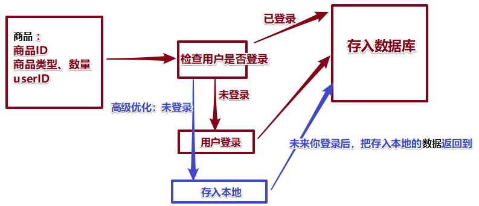

#### 1、小程序封装request请求基础地址baseURL

    

``` JS
    // main，js中导入封装好的基础地址模块
    import request from "@/utils/request"

    // 调用requerst 函数
    const plugin = request({
        baseURL: 'https://api-ugo-web.itheima.net'
    })
    Vue.use(plugin)
```

    

``` JS
    // 新建一个request导出一个函数对uni.request进行封装
    export default function(config) {
        // 将 baseURL 从 config 中解析出来
        const {
            baseURL
        } = config;
        // 这个函数被Vue。use()调用
        return function(Vue) {
            // 往vue原型对象上设置方法？为什么？
            // vue组件：都是Vue实例化，实例都可以使用设置的方法  this.request调用
            Vue.prototype.request = async function(params) {

                // params 接收请求的地址
                const {
                    url
                } = params
                uni.showLoading({
                    title: "数据加载中。。。"
                })
                // 发送真正的请求
                const [err, res] = await uni.request({
                    url: baseURL + url
                })
                uni.hideLoading();
                console.log(err);
                // 返回结果
                return res.data
            }
        }
    }
```

* 这样就可以使用封装好的请求了

    

``` JS
    async getSwiperList() {
        const {
            message
        } = await this.request({
            url: "/api/public/v1/home/swiperdata"
        })
        this.bannerList = message
    }
```

#### 数组去重

* 最简单的数组去重 由于Set中不会出现相同的值
``` JS
//写法1
var arr = [1, 1, 'true', 'true', true, true, 15, 15, false, false, undefined, undefined, null, null, NaN, NaN, 'NaN', 0, 0, 'a', 'a', {}, {}];
console.log([...new Set(arr)]);

//写法2
function unique(arr) {
    return Array.from(new Set(arr))
}
console.log(unique(arr))
// [1, "true", true, 15, false, undefined, null, NaN, "NaN", 0, "a", {…}, {…}]
```

#### 添加购物车步骤分析和代码详解



``` HTML
  <text class="add" @click="addCarts">加入购物车</text>
```

``` JS
 data () {
      return {
        // 详细商品数据
        goods:'',
        // 购物车本地数据1.获取本地数据,防止没有没有数据
        carts:uni.getStorageSync("carts")||[]
      }
    },
```


``` JS
  // 添加到购物车里
      addCarts(){
        // 2.要添加的数据
        var one = {};
        one.goods_id = this.goods.goods_id;
        one.goods_name = this.goods.goods_name;
        one.goods_price = this.goods.goods_price;
        one.goods_small_logo = this.goods.goods_small_logo;
        one.goods_number = 1;
        // 要购买的状态:
        one.goods_buy = true;
        // 3.添加到数组  this.carts:看商品是否重复
        //   3.1 Yes 数量加1；
        // 假设该one 商品没有重复
        var key = "未重复";
        // 验证：key 可能会发生
        for (var i = 0; i < this.carts.length; i++) {
          // 商品重复，数量加1；
          if (this.carts[i].goods_id == one.goods_id) {
            this.carts[i].goods_number++;
            key = "已重复";
            break;
          }
        }
        // 3.2 key：还是 "未重复"：真的没有重复商品,追加新的商品
        if (key=="未重复") {
          this.carts.push(one);
        }
        // 4.记得存回去：本地缓存
        uni.setStorageSync("carts",this.carts);
        // 5.优化：添加成功；
        uni.showToast({title:"添加成功",icon:"none"})
      },
```


